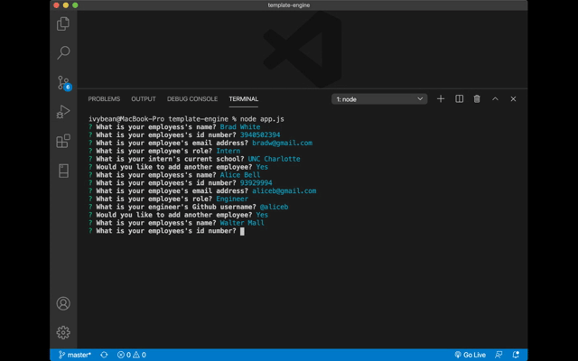

# template-engine
An application that uses command line prompts to generate a templated Team Engine. After answering prompts about their team members an HTML file is generated to display the team members. 

## Application Screenshots
